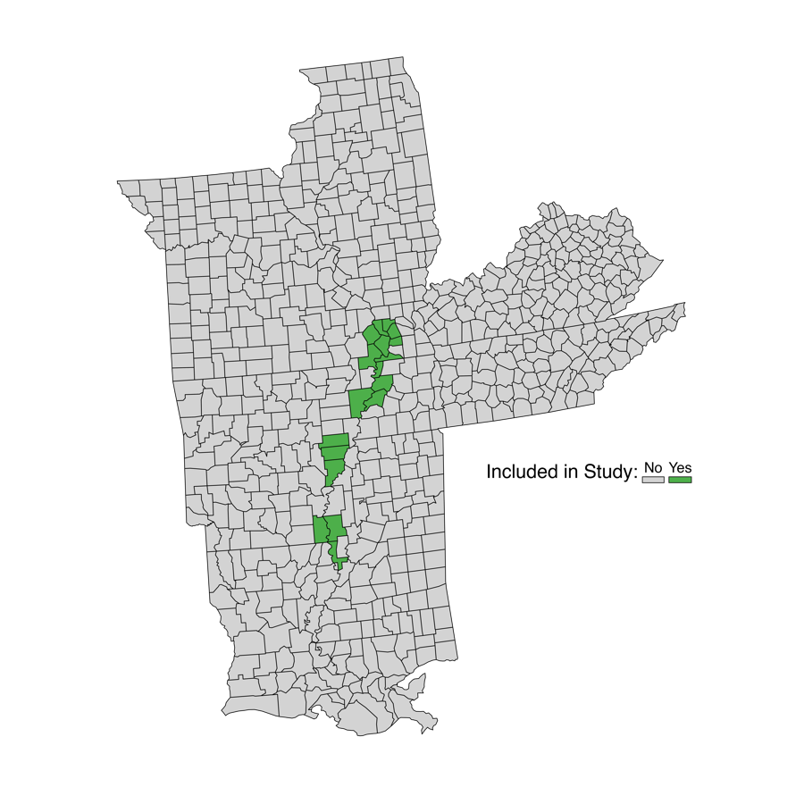
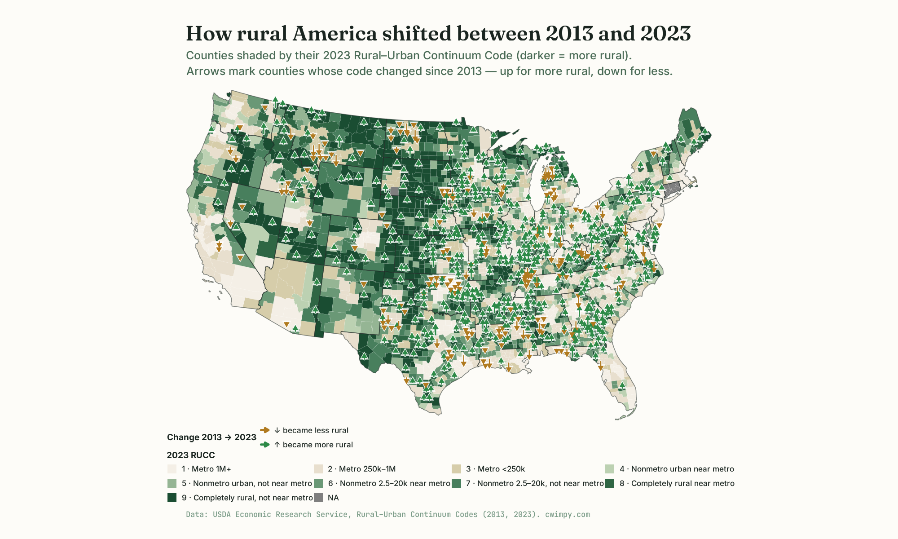

::::::: content-container
::: {.hero-canvas}
<svg class="hero-topo" viewBox="0 0 1200 480" preserveAspectRatio="xMaxYMid slice" aria-hidden="true" focusable="false">
  <g fill="none" stroke="currentColor" stroke-width="1.4">
    <path d="M 1300 -120 Q 700 240 1300 600" />
    <path d="M 1300 -60  Q 760 240 1300 540" />
    <path d="M 1300  0   Q 820 240 1300 480" />
    <path d="M 1300  60  Q 880 240 1300 420" />
    <path d="M 1300 120  Q 940 240 1300 360" />
    <path d="M 1300 180  Q 1000 240 1300 300" />
    <path d="M 1300 240  Q 1060 240 1300 240" />
  </g>
</svg>

:::::: hero-grid
::: hero-image
<picture>
  <source
    type="image/webp"
    srcset="images/profile-360.webp 360w, images/profile-720.webp 720w"
    sizes="(max-width: 768px) 200px, 280px">
  
</picture>
:::

:::: hero-text
# Cameron Wimpy

## Associate Professor & Chair

### Government, Law & Policy • Arkansas State University

I am associate professor of political science and chair of Government, Law & Policy at Arkansas State University with interests in comparative public administration, election administration, political economy, political methodology, and rural public policy. Since 2022, I have also served as the founding director of the [Institute for Rural Initiatives](https://www.astate.edu/a/iri/). I am an affiliate faculty with the [Arkansas Biosciences Institute](https://www.astate.edu/abi) at A-State.

I formerly served as the Research Director in the [MIT Election Data and Science Lab](http://electionlab.mit.edu), where I managed applied research on the scientific study of elections. I was previously an affiliate faculty member with the [Harvard Institute for Quantitative Social Science](https://www.iq.harvard.edu/home). I grew up on [Crowley's Ridge](https://en.wikipedia.org/wiki/Crowley%27s_Ridge) in the Arkansas Delta.

::: social-buttons
[](uploads/cv-wimpy.pdf){.btn-social} [](mailto:cwimpy@astate.edu){.btn-social} [](https://github.com/cwimpy){.btn-social rel="me"} [](https://scholar.google.com/citations?user=LRQ7rpwAAAAJ&hl=en){.btn-social} [](https://www.linkedin.com/in/cwimpy/){.btn-social rel="me"} [](https://orcid.org/0000-0002-2049-5229){.btn-social rel="me"} [](https://x.com/camwimpy){.btn-social rel="me"}
:::
::::
::::::
:::

:::::: {.featured-research}

::::: {.featured-card}
:::: {.featured-card-body}
[Featured · Forthcoming]{.featured-chip}

### [Rural Election Administration in the Lower Mississippi Delta](research.html) {.featured-title}

[with William P. McLean · *Journal of Election Administration Research & Practice*, 2026]{.featured-meta}

[Drawing on interviews with local election officials across 17 counties in six states, this study traces how rural election administration actually runs in the Delta. We elucidate the communication gaps left by shrinking local media, the fight to recruit poll workers amid population decline, the vote-by-mail and bipartisan-balance challenges. We also discuss the quieter advantages of small populations, high local trust, and strong federal and state support.]{.featured-hook}

::: {.publication-buttons}
[<i class="fas fa-quote-right"></i> Cite](#){.btn-pub .citation-btn
  data-citation="@article{mclean2026rural,&#10;  author = {William P. McLean and Cameron Wimpy},&#10;  journal = {Journal of Election Administration Research &amp; Practice},&#10;  title = {Rural Election Administration in the Lower Mississippi Delta},&#10;  volume = {Forthcoming},&#10;  year = {2026}&#10;}"
  data-apsa="McLean, William P. and **Cameron Wimpy**. 2026. &quot;Rural Election Administration in the Lower Mississippi Delta.&quot; *Journal of Election Administration Research &amp; Practice* Forthcoming."
  data-apa="McLean, W. P., &amp; Wimpy, C. (2026). Rural Election Administration in the Lower Mississippi Delta. *Journal of Election Administration Research &amp; Practice*, *Forthcoming*."
  data-mla="McLean, William P., and Cameron Wimpy. &quot;Rural Election Administration in the Lower Mississippi Delta.&quot; *Journal of Election Administration Research &amp; Practice*, 2026."
  data-chicago="McLean, William P. and Cameron Wimpy. 2026. &quot;Rural Election Administration in the Lower Mississippi Delta.&quot; *Journal of Election Administration Research &amp; Practice* Forthcoming."}
:::
::::

:::: {.featured-card-aside}
::: {.featured-card-media}
<picture>
  <source type="image/webp" srcset="images/delta-study-450.webp 450w, images/delta-study-900.webp 900w" sizes="(max-width: 768px) 92vw, 420px">
  
</picture>
[17 counties · 6 states · study area]{.featured-card-media-caption}
:::

[Less than one-fifth of the voting-age population lives in rural areas, yet nearly two-thirds of U.S. elections are administered in rural jurisdictions.]{.featured-tag}
::::
:::::

::::::

```{r}
#| echo: false
#| include: false
rucc_last_built <- if (file.exists("images/rucc-map.png")) {
  format(file.info("images/rucc-map.png")$mtime, "%B %Y")
} else {
  format(Sys.Date(), "%B %Y")
}
```

:::: {.data-exhibit}
::: {.data-exhibit-head}
[From the Institute · Current work]{.section-eyebrow}

### How rural America shifted between 2013 and 2023 {.data-exhibit-title}

[Of 3,219 U.S. counties, **553 became more rural** and **184 became less rural** over the past decade, as measured by USDA's Rural–Urban Continuum Codes. Counties shade darker for higher RUCC; arrows mark every county whose code changed.]{.data-exhibit-subtitle}
:::

::: {.data-exhibit-figure}
[In progress]{.data-exhibit-pill}

{fig-alt="Map of the continental United States. Counties are shaded in a green sequence from light beige (metropolitan) to deep green (most rural). Small arrows overlay counties whose RUCC code changed between 2013 and 2023: green arrows pointing up where counties became more rural, amber arrows pointing down where they became less rural."}
:::

::: {.data-exhibit-caption}
Data: USDA Economic Research Service, [Rural–Urban Continuum Codes](https://www.ers.usda.gov/data-products/rural-urban-continuum-codes) (2013, 2023). Source: [`scripts/rucc-map.R`](https://github.com/cwimpy/cwimpy-website/blob/main/scripts/rucc-map.R). Last rendered: `r rucc_last_built`.
:::
::::

::: home-secondary

::: section-eyebrow
Latest
:::

## Recent writing {.section-title}

::: {#latest-posts}
:::

[All posts →](posts/index.qmd){.section-more-link}

:::
:::::::
