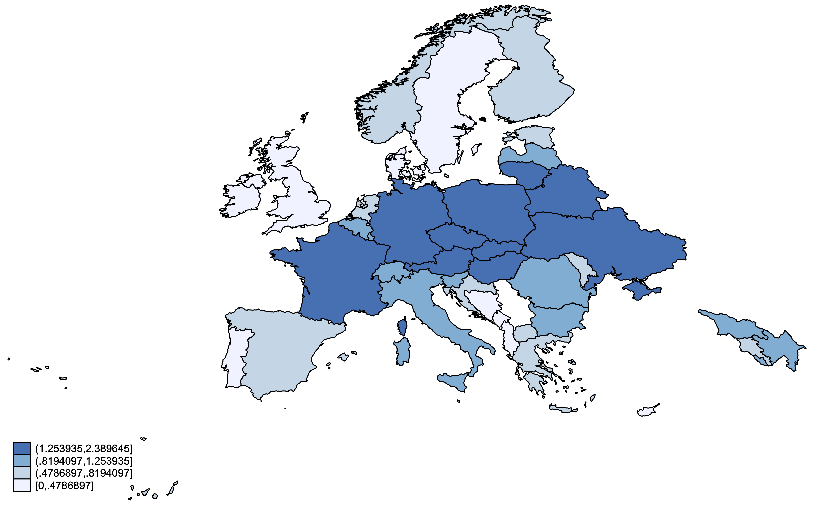

I'm excited to share that our article "X Marks the Spot: Discovering the Treasure of Spatial-X Models" has been published in *The Journal of Politics*.

## About the Research

This work, conducted with Guy D. Whitten and Laron K. Williams, explores the spatial-X framework for analyzing spatial dependencies in political and social data.

### Key Contributions

-   Develops new methodological approaches for spatial modeling
-   Provides practical guidance for researchers working with spatial data
-   Demonstrates applications across multiple substantive areas

### Access the Research

-   **Published Article**: [The Journal of Politics](https://doi.org/10.1086/710089)
-   **Replication Materials**: Available on our project repository
-   **Software**: R packages and code for implementing spatial-X models

This research builds on our ongoing work to make spatial analysis more accessible and useful for political scientists and other social researchers.

### Related Work

This publication is part of a broader research program on spatial methods. See also our work on ["Interpretation: The Final Spatial Frontier"](../2023-06-22-spatial-interpretation/) in *Political Science Research and Methods*.

For questions about the methodology or replication, feel free to reach out!
