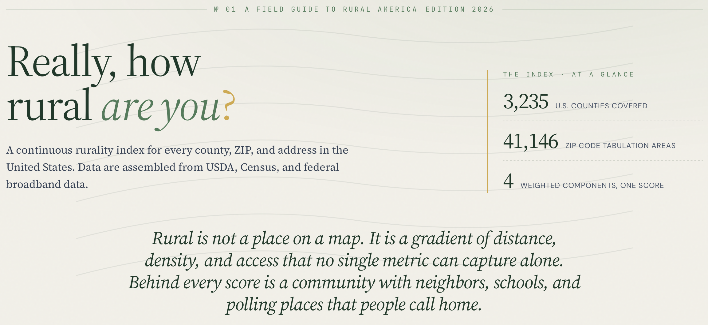
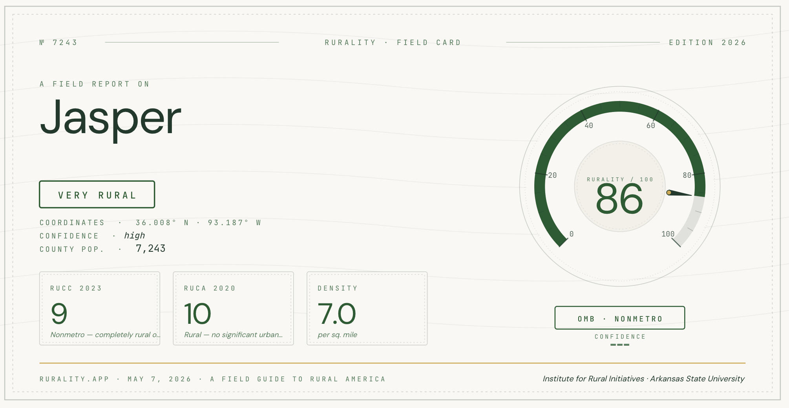
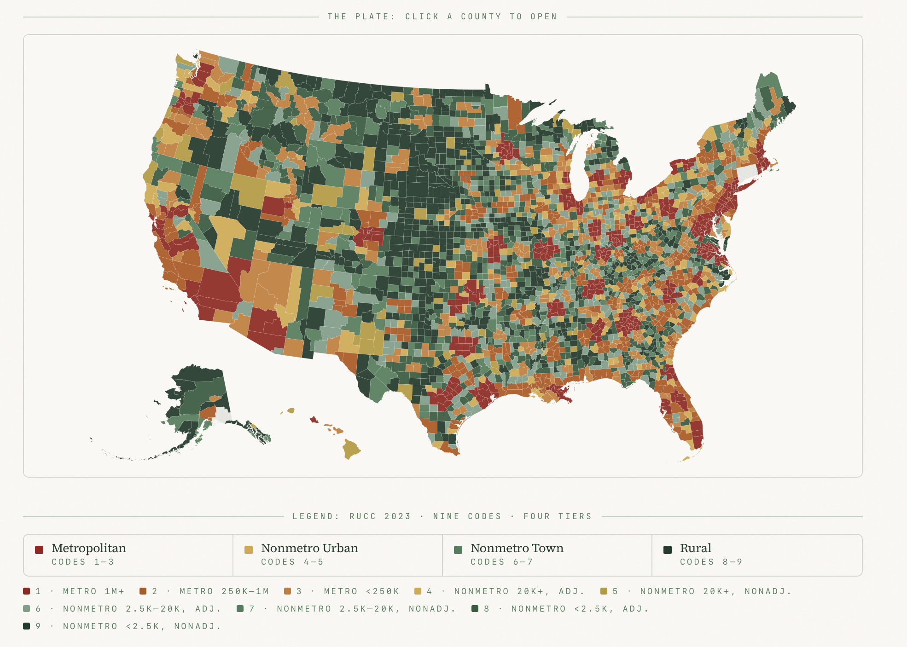

:::: {.content-visible when-format="html"}
::: {.callout-note title="Rural Notes"}
This is the opening post in [Rural Notes](/rural.html), a working-notes
series on rural measurement and rural political behavior. My posts in
this series will include downloadable PDFs and, where appropriate,
replication code.
:::
::::

## A field guide to rural America

[**rurality.app**](https://rurality.app) is a new web companion that I
created as a complement to my
[**rurality**](https://cran.r-project.org/package=rurality) R package.
It takes the same county- and ZIP-level rural–urban classifications that
the package exposes to R users and puts them behind a browser interface
that anyone (e.g., journalists, county officials, students, curious
readers) can use without needing to work with R.

The site's tagline is its premise: *a field guide to rural America*. I
do not really envision this as a database. My hope is that it is an
invitation to look more carefully at things you'd otherwise pass over.
Rural America is not a single category, and the app is built to make
that visible.

[{fig-align="center"}](https://rurality.app)

## What you can do with it

- Look up any U.S. county or ZIP and see its RUCC, RUCA, and composite
  rurality score
- Browse a national map and select any location to learn more
- Compare up to five places side-by-side
- Download the full dataset
- Read short field-notes on what each measure captures and where it
  diverges from the others
- Download the field notes

### Look up a place

To look up a place, go to rurality.app and type a location into the
search bar. You can also use your device's GPS, with permission. Nothing
is tracked intentionally; if you find otherwise, let me know. Once you
pick a spot, you should get information about it fairly quickly. Below
is the exportable field card for Jasper, AR.

[{fig-align="center"}](https://rurality.app)

### See the national picture

You can also click on the map feature and simply pick out a spot. From
either the map or the search, you can then learn all about the place
using the dashboard. I plan to keep adding to this over time as I get
the data cleaned and accessed through APIs.

#### For RUCC, specifically

The US counties page provides an interactive map of the RUCC. Simply
click on a county to learn more.

[{fig-align="center"}](https://rurality.app)

### Read the measure, not just the value

Each measurement captures specific things. It is a good idea to
understand what each one does, and does not capture. Many of the
measures were developed for specific applications and need to be
understood in that context. The measures also apply to different levels
of geography. For example, the RUC codes will map to counties that may
have metro centers but relatively rural areas otherwise. The RUCA codes,
on the other hand, are mapped to the [ZIP Code Tabulation Areas
(ZCTAs)](https://www.census.gov/programs-surveys/geography/guidance/geo-areas/zctas.html),
which are obviously much more granular than the whole county. The
methodology page provides more details on this and links to the original
source documentation.

### Take the data with you

The safest place to fetch any of the included data may be the original
sources! But, since that is not always easy, I included a "for
researchers" page that allows you to download the data used in the
app/package. I have done my best to make sure everything is cleaned and
merged properly, but just note that I am not currently making any
promises. This page also provides examples of using the R package. If
you cite anything please cite the original sources. If you end up using
my index please cite me, but again, do so knowing it is under
development.

## Why a web tool, not just a package

The rurality R package already does some of the heavy lifting for
researchers. It includes USDA's Rural–Urban Continuum Codes, Rural–Urban
Commuting Area codes, and a composite rurality score under a single
consistent interface. I am working to make sure these merge as cleanly
as possible with county FIPS or local zip.

Most of the people who might benefit from looking up rural–urban
classifications are not R users. They are reporters writing about a
specific county, county officials trying to make sense of a federal
funding formula that hinges on metro/non-metro status, students writing
papers, and perhaps anyone who has ever read a story about "rural
America" and wondered which rural America it was talking about. My hope
is that rurality.app makes this an easier process.

I also have been working on expanding my research agenda on rural
election administration, measurement, and public opinion. This selfish
reason, as much as anything, is why I have created a new way to publicly
document that effort. In Rural Notes (the series this post opens) I
argue that a finding about rural America is only as good as the rurality
measure that produced it. That argument is easier to make when the
reader can spend two minutes on rurality.app and see for themselves how
a single county can be "rural" under one classification and
"metro-adjacent" under another.

## The data underneath

Three layers, all keyed by FIPS or ZIP, all available in the
[**rurality**](https://cran.r-project.org/package=rurality) R package
and [**rurality-stata**](https://github.com/cwimpy/rurality-stata):

- **Rural–Urban Continuum Codes (RUCC 2023)**: USDA's nine-point
  metro/non-metro scale, one row per county. This is one of the most
  accessible and (at least in my experience) one of the most commonly
  used measures since it neatly maps to counties.
- **Rural–Urban Commuting Area Codes (RUCA 2020)**: USDA's
  commuting-flow-based classification, finer-grained than RUCC, one row
  per ZIP code tabulation area.
- **A composite rurality score**: a continuous measure I built for
  situations where collapsing nine RUCC buckets into "rural vs. urban"
  throws away too much signal but keeping all nine as categorical
  dummies eats degrees of freedom. *This one is a work in progress and
  should be used under that assumption.*

The web app and the R/Stata packages are deliberately three faces of the
same thing. If you look up a county on rurality.app, the values you see
are the values you'd get from `rurality_counties()` in R. There is no
hidden version, no proprietary score behind the web app, and the data
will move forward in step when USDA releases new vintages.

## Where it fits in the Rural Notes program

rurality.app is the public front door to a research program on three
dimensions of rural in which I am currently interested: measurement,
public policy (mostly in the form of election administration), and
political attitudes and behavior. The posts that follow this one will
often use the data the app provides. Sometimes these data will be joined
to public-opinion surveys like the Pew American Trends Panel, sometimes
joined to election returns, and sometimes just considered on its own. I
want to ask substantive questions both about how rural Americans think
and experience public policy, and how the answer depends on which
"rural" you mean.

The next post in the series will work through that measurement question
directly, using the app's own data layers as the running example. After
that, I hope to settle into a rotation of measurement essays,
re-analyses of public data, reviews of other people's work, and short
puzzles about what an ideal survey would have to measure.

## Try it

[**rurality.app**](https://rurality.app) is live and free. There is
nothing to install and no account to create. If you find something
broken, confusing, or worth a feature request, you can reach me through
the [contact form](/contact.html) or open an issue on the [GitHub
repository](https://github.com/cwimpy/rurality).

::: {.content-visible when-format="html"}
*Rural Notes is a working-notes series. The posts are
research-in-progress, not finished work. Subscribe via [RSS](/rural.xml)
for occasional updates.*
:::
