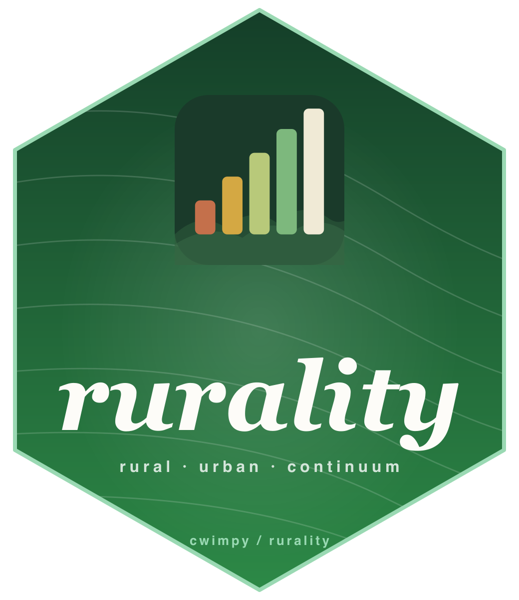
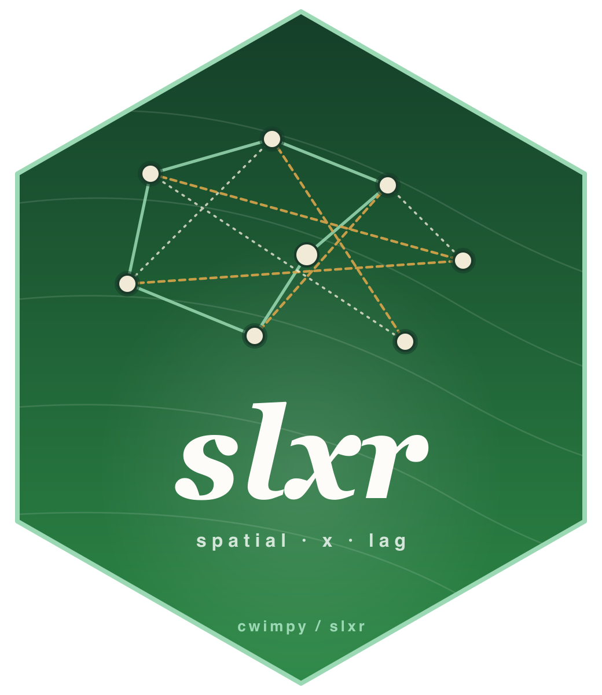

::: {.content-container}

I build tools and packages related to my research on election administration, rural public policy, and political methodology. Most projects use R and are available on [GitHub](https://github.com/cwimpy).

## R/Stata Packages

:::: {.software-card .has-media}
::: {.software-card-body}
### rurality (R)
Rurality classification and scoring for U.S. counties and ZIP codes. Provides USDA Rural-Urban Continuum Codes (RUCC 2023), Rural-Urban Commuting Area codes (RUCA 2020), and a composite rurality score for all 3,235 U.S. counties. Built to make rurality data easy to use in research without manually downloading and merging USDA spreadsheets. Now available on [CRAN](https://cran.r-project.org/package=rurality).

**Install:**
```r
install.packages("rurality")
```

[ CRAN](https://cran.r-project.org/package=rurality){.btn-pub}
[ GitHub](https://github.com/cwimpy/rurality){.btn-pub}
[ rurality.app](https://rurality.app){.btn-pub}
:::

::: {.software-card-media}
{fig-alt="rurality package hex sticker: italic wordmark over topographic contour lines with a bar-chart-and-hills motif at top"}
:::
::::

::: {.software-card}
### rurality (Stata)
Stata implementation of the rurality package. Merges USDA Rural-Urban Continuum Codes (RUCC 2023) and a composite rurality score onto any dataset by county FIPS code. Includes optional variables for population density, metro distance, median income, and age composition.

**Install:**
```stata
net install rurality, from("https://raw.githubusercontent.com/cwimpy/rurality-stata/main/")
rurality_install
```

[ GitHub](https://github.com/cwimpy/rurality-stata){.btn-pub}
:::

:::: {.software-card .has-media}
::: {.software-card-body}
### slxr (R)
Spatial-X (SLX) regression models for applied researchers. Provides a formula-based interface with first-class support for variable-specific weights matrices, higher-order spatial lags, temporally-lagged spatial variables, and tidy direct/indirect/total effects decomposition --- no matrix inversion or simulation required. Built to center SLX rather than treat it as a consolation prize for SAR, and to make the variable-specific-`W` approach from [Wimpy, Whitten, and Williams (2021)](https://doi.org/10.1086/710089) easy to actually use. `modelsummary`-compatible via `tidy()` and `glance()` methods.

**Install:**
```r
remotes::install_github("cwimpy/slxr")
```

[ GitHub](https://github.com/cwimpy/slxr){.btn-pub}
[ Documentation](https://cwimpy.github.io/slxr/){.btn-pub}
[ Paper](https://doi.org/10.1086/710089){.btn-pub}
:::

::: {.software-card-media}
{fig-alt="slxr package hex sticker: three overlapping networks on a shared node set, representing variable-specific weights matrices"}
:::
::::

---

## Applications

::: {.software-card}
### Rurality App
A web application for computing and exploring rurality scores across U.S. communities. Companion to the rurality R and Stata packages.

**Stack:** React

[ GitHub](https://github.com/cwimpy/rurality-app){.btn-pub}
[ rurality.app](https://rurality.app){.btn-pub}
:::

---

## Templates

::: {.software-card}
### wimpy-paper
Quarto + Typst manuscript template for academic papers. Ships with APSA citation style, sensible typography and spacing defaults, YAML-driven metadata (authors, affiliations, ORCID, abstract, keywords), and a single `manuscript.qmd` entry point. Typst renders in a fraction of the time LaTeX takes, and the format is easily retargeted to other disciplines by swapping the `.csl` file.

**Install:**
```bash
quarto use template cwimpy/wimpy-paper
```

[ GitHub](https://github.com/cwimpy/wimpy-paper){.btn-pub}
:::

---

*Have questions about any of these projects? [Get in touch.](contact.qmd)*

:::
