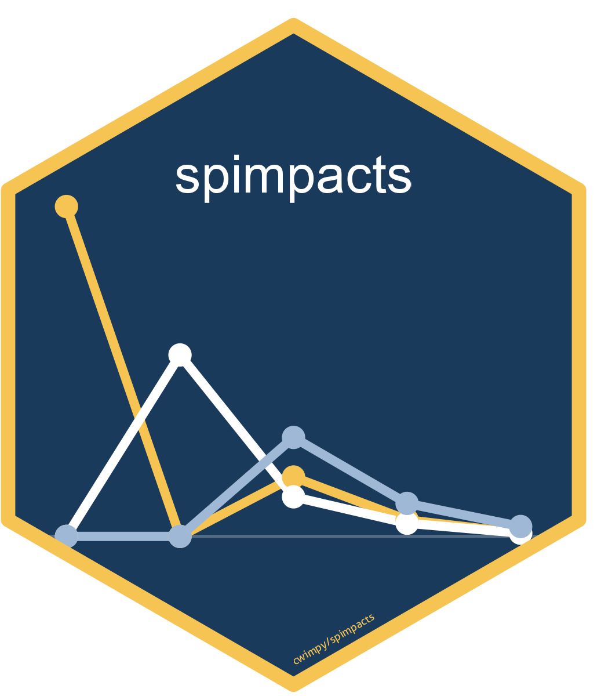

::: {.content-container}

I build tools and packages related to my research on election administration, rural public policy, and political methodology. Most projects use R and are available on [GitHub](https://github.com/cwimpy).

## R/Stata Packages

:::: {.software-card .has-media}
::: {.software-card-body}
### rurality (R)
Rurality classification and scoring for U.S. counties and ZIP codes. Provides USDA Rural-Urban Continuum Codes (RUCC 2023), Rural-Urban Commuting Area codes (RUCA 2020), and a composite rurality score for all 3,235 U.S. counties. Built to make rurality data easy to use in research without manually downloading and merging USDA spreadsheets. Now available on [CRAN](https://cran.r-project.org/package=rurality).

**Install:**
```r
install.packages("rurality")
```

[ CRAN](https://cran.r-project.org/package=rurality){.btn-pub}
[ GitHub](https://github.com/cwimpy/rurality){.btn-pub}
[ rurality.app](https://rurality.app){.btn-pub}
:::

::: {.software-card-media}
{fig-alt="rurality package hex sticker: italic wordmark over topographic contour lines with a bar-chart-and-hills motif at top"}
:::
::::

::: {.software-card}
### rurality (Stata)
Stata implementation of the rurality package. Merges USDA Rural-Urban Continuum Codes (RUCC 2023) and a composite rurality score onto any dataset by county FIPS code. Includes optional variables for population density, metro distance, median income, and age composition.

**Install:**
```stata
net install rurality, from("https://raw.githubusercontent.com/cwimpy/rurality-stata/main/")
rurality_install
```

[ GitHub](https://github.com/cwimpy/rurality-stata){.btn-pub}
:::

:::: {.software-card .has-media}
::: {.software-card-body}
### slxr (R)
Spatial-X (SLX) regression models for applied researchers. Provides a formula-based interface with first-class support for variable-specific weights matrices, higher-order spatial lags, temporally-lagged spatial variables, and tidy direct/indirect/total effects decomposition with no matrix inversion or simulation required. Built to center SLX rather than treat it as a consolation prize for SAR, and to make the variable-specific-`W` approach from [Wimpy, Whitten, and Williams (2021)](https://doi.org/10.1086/710089) easy to actually use. `modelsummary`-compatible via `tidy()` and `glance()` methods. Now available on [CRAN](https://cran.r-project.org/package=slxr).

**Install:**
```r
install.packages("slxr")
```

[ CRAN](https://cran.r-project.org/package=slxr){.btn-pub}
[ GitHub](https://github.com/cwimpy/slxr){.btn-pub}
[ Documentation](https://cwimpy.github.io/slxr/){.btn-pub}
[ Paper](https://doi.org/10.1086/710089){.btn-pub}
:::

::: {.software-card-media}
{fig-alt="slxr package hex sticker: three overlapping networks on a shared node set, representing variable-specific weights matrices"}
:::
::::

:::: {.software-card .has-media}
::: {.software-card-body}
### spimpacts (R)
Model-agnostic interpretation layer for spatial econometric models. Computes the partial-derivatives matrix, partitions direct, indirect, and total effects by order of the weights matrix, produces simulation-based uncertainty intervals, and generates origin-specific shock maps and per-unit decay plots. Built around the general approach in [Whitten, Williams, and Wimpy (2021)](https://doi.org/10.1017/psrm.2019.9). Ships with first-class support for `slxr` SLX fits and `spatialreg` SAR/SDM fits.

**Install:**
```r
# install.packages("remotes")
remotes::install_github("cwimpy/spimpacts")
```

[ GitHub](https://github.com/cwimpy/spimpacts){.btn-pub}
[ Paper](https://doi.org/10.1017/psrm.2019.9){.btn-pub}
:::

::: {.software-card-media}
{fig-alt="spimpacts package hex sticker: three overlapping decay-plot lines in yellow, white, and slate-blue on a navy ground, evoking the per-unit decay plots the package produces"}
:::
::::

:::: {.software-card .has-media}
::: {.software-card-body}
### certify (R)
Generates branded landscape PDF certificates with configurable color themes, optional logos, decorative borders, laurels, and corner ornaments. Built on base R's `grid` graphics with no LaTeX or Quarto dependency required. Suitable for academic awards, professional recognition, and similar uses. Now available on [CRAN](https://cran.r-project.org/package=certify).

**Install:**
```r
install.packages("certify")
```

[ CRAN](https://cran.r-project.org/package=certify){.btn-pub}
[ GitHub](https://github.com/cwimpy/certify){.btn-pub}
:::

::: {.software-card-media}
{fig-alt="certify package hex sticker: an illustrated landscape certificate with gold border centered on a cream hexagon with navy border, italic 'certify' wordmark below"}
:::
::::

---

## Applications

::: {.software-card}
### Rurality App
A web application for computing and exploring rurality scores across U.S. communities. Companion to the rurality R and Stata packages.

**Stack:** React

[ GitHub](https://github.com/cwimpy/rurality-app){.btn-pub}
[ rurality.app](https://rurality.app){.btn-pub}
:::

---

## Typesetting

::: {.software-card}
### ab-annotate
Cross-format package for producing annotated bibliographies that display both abstracts and user-written annotations beneath each citation entry. Provides three independent implementations that share the same `.bib` file format: a **LaTeX** biblatex package (available on CTAN as [`biblatex-abs-annote`](https://ctan.org/pkg/biblatex-abs-annote), shipping with TeX Live and MiKTeX), a **Typst** module (published on [Typst Universe](https://typst.app/universe/package/ab-annotate) as `ab-annotate`), and a **Quarto** extension (Lua filter targeting PDF, HTML, Typst, and Word). Reads standard `abstract` and `annotation`/`annote` BibTeX fields. No custom entry types are required to get started.

**Install (LaTeX via CTAN):**
```bash
tlmgr install biblatex-abs-annote
```

**Import (Typst Universe):**
```typst
#import "@preview/ab-annotate:0.1.0": annotated-bib
```

**Install (Quarto extension):**
```bash
quarto add cwimpy/ab-annotate
```

A working Quarto example lives in [`examples/quarto/`](https://github.com/cwimpy/ab-annotate/tree/main/examples/quarto).

[ GitHub](https://github.com/cwimpy/ab-annotate){.btn-pub}
[ CTAN](https://ctan.org/pkg/biblatex-abs-annote){.btn-pub}
[ Typst Universe](https://typst.app/universe/package/ab-annotate){.btn-pub}
:::

::: {.software-card}
### nametags
Pure-Typst package for conference nametag badges (4×3 in lanyard inserts) and table tents (tabloid landscape, folded to 11×4.25 in), driven from any CSV or iterable. No LaTeX, no R, no preprocessing — `typst compile` produces print-ready output directly. Ships with two ready-to-go layouts (`nametag` and `nametent`) plus a small helper API for customizing affiliation, conference, and logo metadata.

**Import (local checkout):**
```typst
#import "/path/to/nametags-package/lib.typ": nametag, nametent
```

[ GitHub](https://github.com/cwimpy/typst-templates/tree/main/nametags-package){.btn-pub}
:::

---

## Templates

::: {.software-card}
### typst-templates
A collection of Quarto + Typst templates for common academic documents. Right now I have working papers, CVs, posters, policy briefs, reports, peer reviews, cover letters, and administrative documents. Each downloads as a Quarto extension you can install with one command.

[ Browse all templates](/templates.html){.btn-pub}
[ GitHub](https://github.com/cwimpy/typst-templates){.btn-pub}
:::

::: {.software-card}
### astate-pres
Arkansas State University presentation templates for **Beamer (LaTeX)** and **revealjs (Quarto)**, available with six installable Quarto extensions: a generic A-State pair plus unit-specific variants for GLP (Government, Law & Policy) and IRI (Institute for Rural Initiatives). All share Inter + Fraunces typography, A-State brand colors, ORCID/affiliation metadata handling, and a `Makefile` build workflow; variants differ only in logo and contact-slide content.

**Install (generic A-State):**
```bash
quarto use template cwimpy/astate-pres/astate-beamer
quarto use template cwimpy/astate-pres/astate-revealjs
```

[ GitHub](https://github.com/cwimpy/astate-pres){.btn-pub}
:::

---

*Have questions about any of these projects? [Get in touch.](contact.qmd)*

:::
