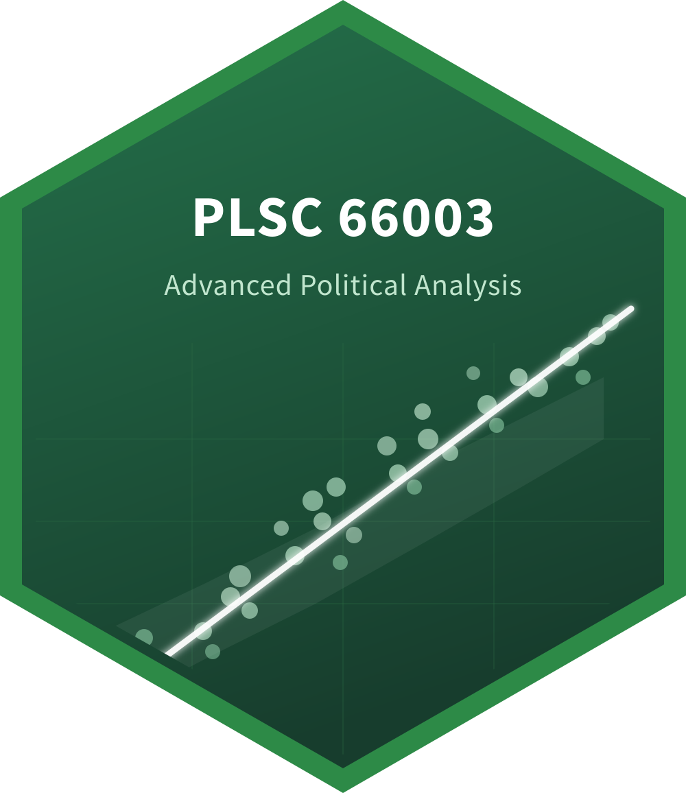

::: {.content-container .course-page .course-plsc66003}

::: {.course-hero}
::: {.course-hero-text}
[ PLSC 66003 · Fall 2026]{.course-chip}

# Advanced Political Analysis {.course-title}

[Graduate-level quantitative methods for political science. Build the toolkit you need to design, run, and present original research — entirely in R.]{.course-tagline}
:::

::: {.course-hero-art}
{fig-alt="PLSC 66003 hex sticker"}
:::
:::

::: {.course-meta-bar}
::: {.course-meta-cell}
[Credits]{.label}
[3]{.value}
:::
::: {.course-meta-cell}
[Meets]{.label}
[1×/wk]{.value}
:::
::: {.course-meta-cell}
[Format]{.label}
[Seminar]{.value}
:::
::: {.course-meta-cell}
[Instructor]{.label}
[[Wimpy](mailto:cwimpy@astate.edu)]{.value}
:::
:::

::: {.course-quick-links}
[ Schedule](schedule.qmd){.course-quick-link}
[ Weekly content](content/){.course-quick-link}
[ Assignments](assignments/){.course-quick-link}
[ Resources](resources.qmd){.course-quick-link}
[ Office hours](){.course-quick-link}
:::

## Overview

This course introduces graduate students to the theory and application of quantitative methods in political science. We cover the foundations of statistical inference, linear regression, maximum likelihood estimation, and model diagnostics using R. The goal is for students to leave the course able to **conduct, interpret, and present original quantitative research**.

All computing is done in [R](https://www.r-project.org/) using the [tidyverse](https://www.tidyverse.org/) and [ggplot2](https://ggplot2.tidyverse.org/). We use [Quarto](https://quarto.org/) for reproducible documents.

## What you'll learn

::: {.learning-objectives}
- Formulate testable hypotheses from political science theories
- Manage, clean, and visualize data using R and the tidyverse
- Estimate and interpret linear regression models
- Assess model fit and diagnose violations of assumptions
- Present statistical results in publication-ready tables and figures
- Produce reproducible research documents with Quarto
:::

## Logistics

::: {.course-meta-bar}
::: {.course-meta-cell}
[Meeting time]{.label}
[TBD]{.value}
:::
::: {.course-meta-cell}
[Location]{.label}
[TBD]{.value}
:::
::: {.course-meta-cell}
[Office]{.label}
[HSS 3007]{.value}
:::
::: {.course-meta-cell}
[Office hours]{.label}
[[By appt.]()]{.value}
:::
:::

## First three weeks {#schedule-preview}

::: {.course-schedule}

| Wk | Date | Topic | Due |
|:--:|------|-------|:---:|
| 01 | Aug 19 | [Introduction & course overview](content/01-intro.qmd) | |
| 02 | Aug 26 | [R fundamentals and the tidyverse](content/02-r-tidyverse.qmd) | |
| 03 | Sep 2  | [Data visualization with ggplot2](content/03-dataviz.qmd) | [PS 1](assignments/ps01.qmd) |

:::

[See the full 14-week schedule →](schedule.qmd){.schedule-preview-link}

:::
